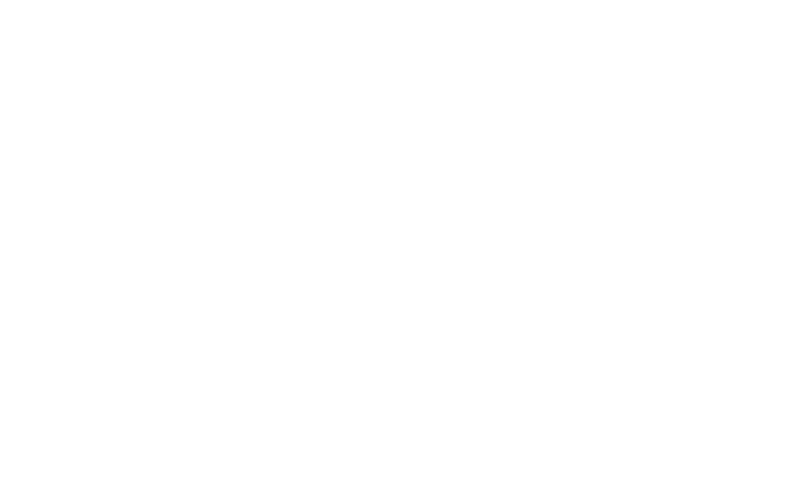
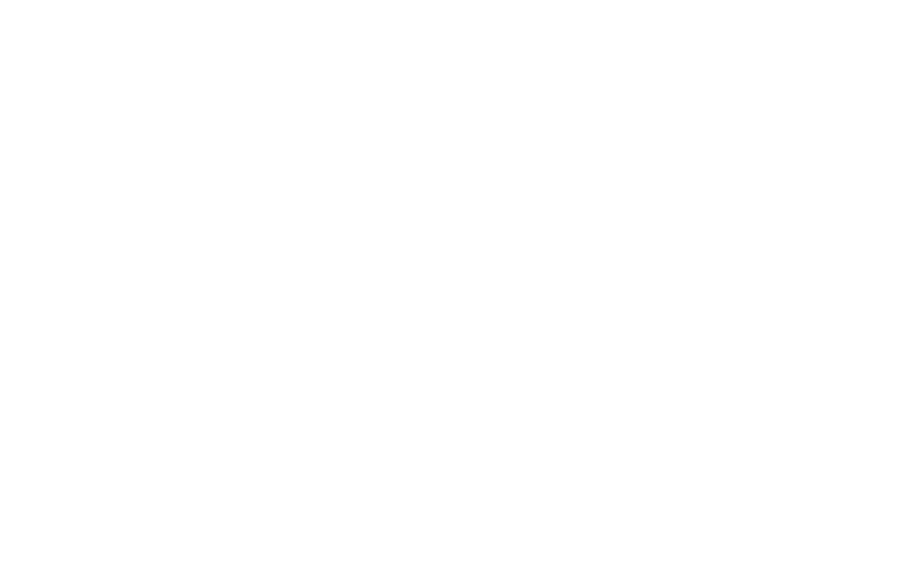
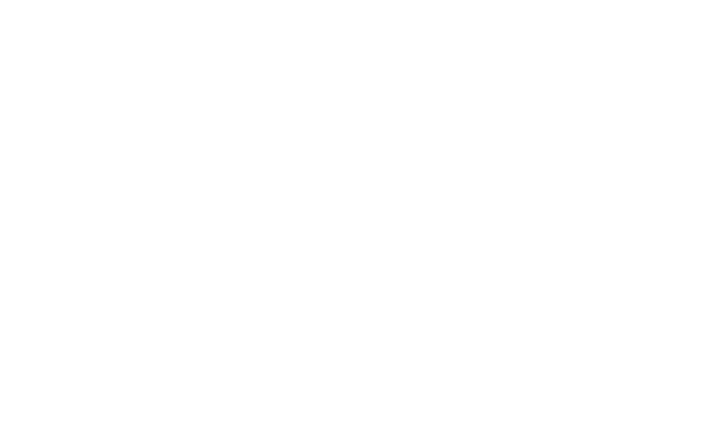
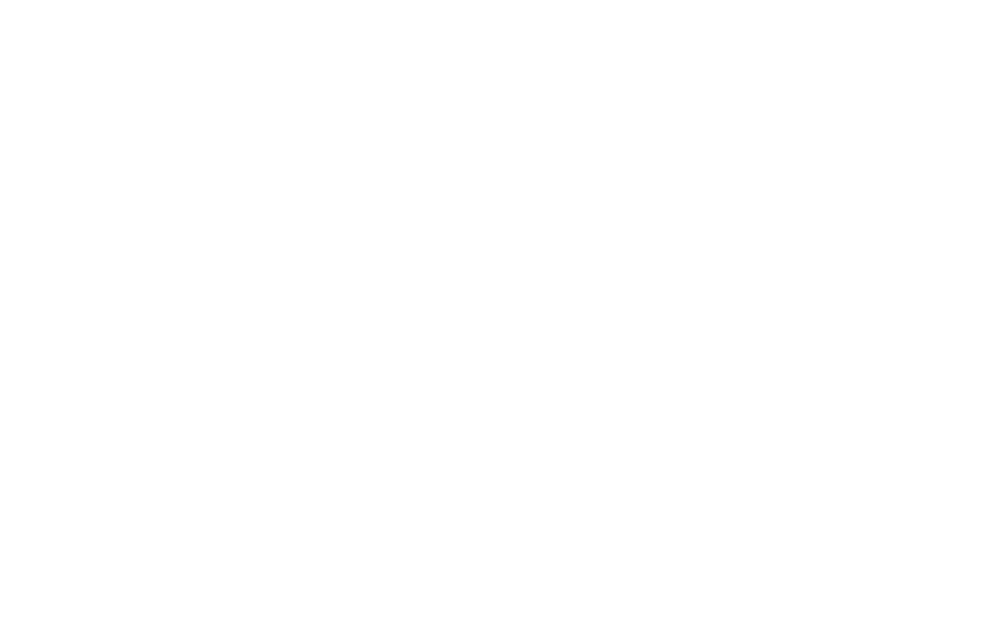
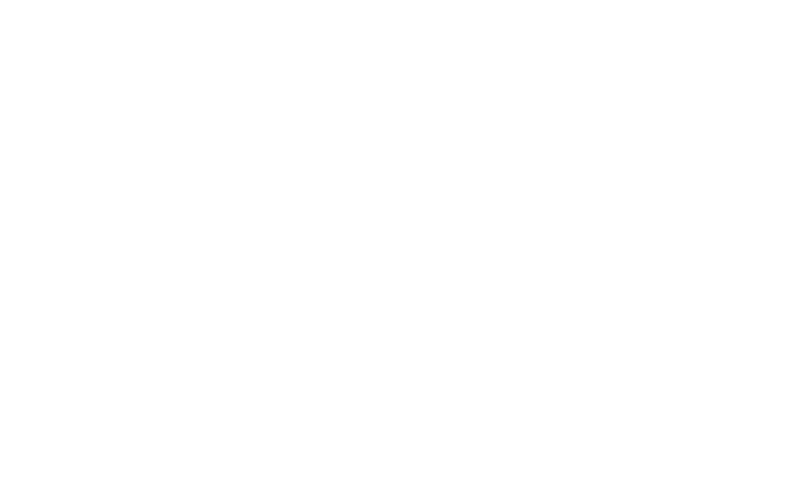
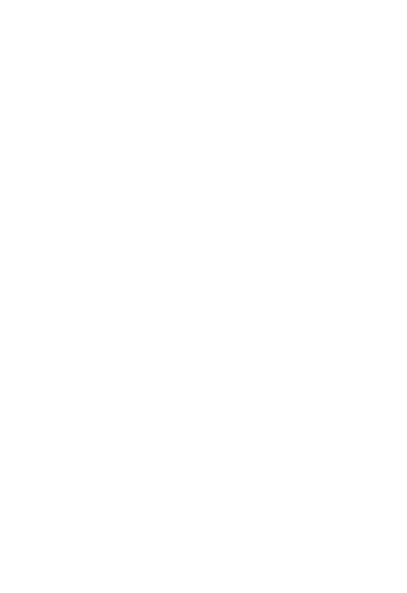
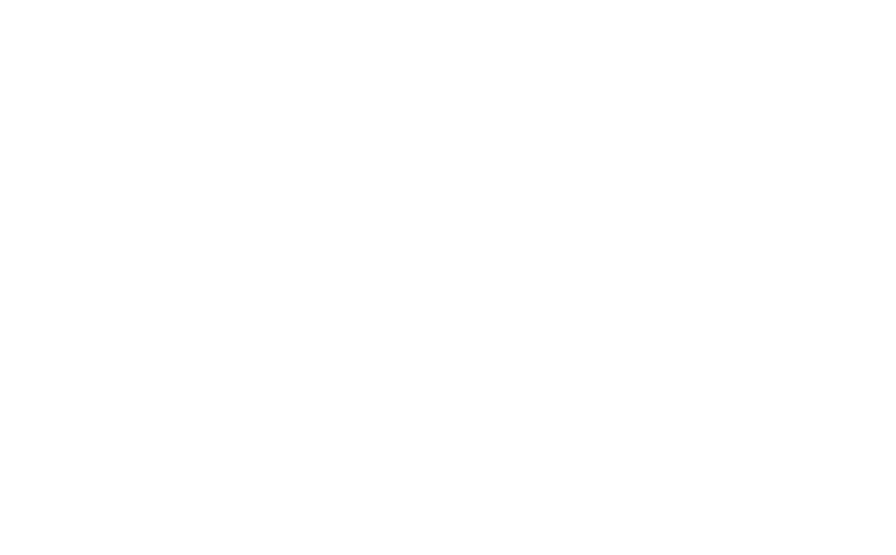

# Ale, My Eyes! Desktop

> **Beta**：通过手机语音与电脑交互，在桌面端理解屏幕、预览计划并确认操作。

## 它是什么

Ale, My Eyes! 是面向视障用户的桌面无障碍辅助工具。手机负责语音输入，桌面端负责屏幕理解、模型调度和经过确认的自动化操作。

你可以询问屏幕内容，也可以请求点击、输入或打开应用。桌面端会展示待确认的操作计划，提供确认、拒绝、暂停和断开连接入口。模型能力可以来自已安装的本地模型，也可以来自你配置并授权的云端服务。

这个桌面端完全独立于移动端代码库。它拥有自己的核心（`ale-core`）、自己的图形界面（`ale-gui`）、自己的命令行工具（`ale-cli`）和一个新的模型调用工具（`ale-modeld`）。

## 界面预览

桌面界面分为配对、工作、设置三个页面，支持中文、英文、高对比度和最小 440 × 640 的紧凑窗口布局。

以下截图由原生 Slint 界面预览程序生成。设备地址、二维码、配对码、任务、延迟、模型状态和能力测试结果均为内置演示数据，不是真实会话或服务商验收记录。紧凑窗口截图展示的也是桌面端。

### 工作页

查看连接设备、局域网延迟、当前任务和待确认操作。向下滚动可查看本地模型状态与活动记录。



### 配对页

通过二维码或配对信息连接手机，查看配对码有效期和连接状态。



### 设置页

分别配置服务商、接口协议、API Key、地址、模型和超时。高级选项提供备用端点，云端语音识别使用独立配置。



<details>
<summary>查看备用模型、能力测试、独立转写与高对比度界面</summary>

**备用模型与能力测试**：备用端点需要单独授权；测试结果按能力显示状态和耗时。



**独立转写配置**：语音识别拥有自己的地址、密钥、模型和超时，界面同时展示英文与高对比度样式。



**测试前确认**：列出目标模型、地址、请求次数和费用提示。下图为最窄桌面窗口，目标列表可以滚动。



**工作页的模型状态与记录**：模型状态来自调度器，活动记录保留当前会话的处理进度。



</details>

截图来源和复现命令见 [截图说明](assets/screenshots/README.md)，界面行为见 [桌面前端说明](ale-gui/FRONTEND.md)。

## 核心能力

### 持续语音交互

配对手机后，通过移动端输入语音。你可以问："屏幕上有什么？""帮我写一封邮件。""这个按钮是做什么的？"桌面界面不会自动打开电脑麦克风。语音优先交给本地 SenseVoiceSmall；是否使用云端转写或规划，取决于配置与授权。

### 屏幕与视觉理解

应用可以捕获你的屏幕画面，交给视觉语言模型分析。它不会擅自行动——每次涉及点击、输入或修改的操作，都会先向你描述它打算做什么，等待你的确认。

### 本地模型调度器 (`ale-modeld`)

这是桌面端的新器官。它管理着本地 AI 模型的生命周期：

- **SenseVoiceSmall**：本地语音识别，将你的语音转成文字。运行在你的 CPU 上，不需要联网。
- **Qwen2.5-VL**：本地视觉语言模型，理解屏幕内容。需要 GPU 支持（Vulkan）。
- **ShowUI**：本地 UI 理解模型，定位屏幕上的可交互元素。同样需要 GPU。

`ale-modeld` 会智能地调度这些模型：同一个模型请求会复用已加载的进程；切换模型时会优雅地卸载前一个；闲置 120 秒后自动释放资源，避免一直占用你的显卡内存。如果检测到 GPU 内存不足，它会禁用该模型能力，直到你重新配置或重启。

**注意**：本地模型需要单独下载。完整模型集约需 31 GB 下载空间和 40 GB 解压空间。

Windows 用户可以使用以下脚本下载：

```bat
scripts\download-models.bat
```

### 加密远程会话（协议3）

桌面端可以作为一个安全的本地服务器，让你的 Android 手机连接进来。这一切通过 **Noise-over-WebSocket** 加密，**协议3** 带来了：

- 实时进度反馈（"正在分析屏幕...""等待你的确认..."）
- 显式的隐私/风险决策（高危操作需要人工确认）
- 显示内容和语音内容的脱敏（屏幕描述和朗读内容可以不同）
- 自动拒绝旧版本客户端，防止兼容性问题

配对通过扫描二维码完成。配对凭据保存在内存中，界面显示有效期；刷新会生成新的配对信息，已认证的连接不会因此重启。

### 云端模型与能力测试

服务商预设和实际接口协议分别配置，自定义端点也可以选择对应协议：

| 接口协议 | 生成接口 |
| --- | --- |
| OpenAI Chat Completions | `/chat/completions` |
| OpenAI Responses | `/responses` |
| Anthropic Messages | `/messages` |
| Google Gemini | `/models/{model}:generateContent` |

- **统一工具调用**：文本与图片请求均可携带工具；返回的工具名称、参数和完成状态会经过校验，再进入操作确认流程。
- **按需测试**：使用设置草稿测试文本、图片及工具调用能力。确认目标与费用后才发送内置样本，支持取消；启动和保存设置不会自动测试。
- **独立语音转写**：单独设置转写端点、密钥、模型和超时，使用 OpenAI 兼容转写接口。新配置默认关闭，默认模型为 `whisper-1`；旧配置会一次性迁移原先共用的转写设置。
- **授权备用切换**：备用端点默认关闭，需要明确授权。仅对适合重试的临时故障进行重试或切换，不重放桌面操作。
- **统一请求预算**：桌面处理总预算为 85 秒，单端点超时可设为 1–80 秒。进行中的请求固定使用原配置，保存后的配置应用到后续请求。
- **可靠保存**：配置文件原子替换；主模型、备用模型和转写密钥分别存储。保存失败会回滚并显示错误。

协议映射、迁移规则和重试边界见 [模型调用说明](MODEL-CALLING.md)。

## 隐私

我们相信隐私是我们服务的重中之重。为了保护您的隐私，我们一直在寻求让AME最大限度保护您的隐私。

- **明确数据去向**：手机与桌面通过加密局域网会话通信；配置并授权云端推理后，相应的文本、音频或图片会发送到所选端点。本地模型需要先下载并通过运行环境检查。
- **云端可选**：如果你选择使用 OpenAI、Anthropic、Google 或其他云服务商，API 密钥存储在操作系统密钥库中，从不写入普通配置文件。
- **HTTPS 强制**：远程云 API 端点必须使用 HTTPS，仅允许 localhost 或回环地址使用 HTTP 进行本地测试。
- **测试样本隔离**：能力测试只发送内置提示、图片和音频，不采集当前屏幕或麦克风。配对页和设置页会暂停屏幕捕获。
- **透明**：每次自动化操作前，你会确切知道电脑打算做什么。

## 开发

```bash
# 先构建桌面程序及其模型调度器
cargo build -p ale-gui -p ale-modeld --locked

# 启动图形界面
cargo run -p ale-gui

# 查看配置状态
cargo run -p ale-cli -- status

# 运行核心测试
cargo test -p ale-core

# 运行工作区本地检查
cargo fmt --all -- --check
cargo check --workspace --locked
cargo test --workspace --locked
cargo clippy --workspace --all-targets --locked -- -D warnings

# 额外的平台、压力与打包检查（按目标环境选用）
./scripts/verify-pc-issues.sh
./scripts/stress-pc-io.sh
./scripts/test-source-package.sh
./scripts/smoke-linux.sh
```

Linux 开发需要安装系统依赖：

```bash
sudo apt-get install -y libclang-dev libspeechd-dev libasound2-dev libfontconfig-dev libpipewire-0.3-dev libwayland-dev libxrandr-dev libdbus-1-dev libegl-dev libgbm-dev libxcb-shape0-dev libxcb-xfixes0-dev netcat-openbsd xvfb
```

## Nix / NixOS

```bash
nix run .          # 启动 GUI
nix run .#cli -- status   # CLI
nix develop        # 进入开发 shell
```

NixOS 模块：

```nix
programs.ale-my-eyes.enable = true;
```

## 打包

```bash
./scripts/package-linux.sh    # Linux tar.gz
./scripts/package-windows.sh  # Windows zip
```


## 与移动端的关系

桌面端和移动端是两个独立的系统，通过加密协议对话：

- **移动端**（`ale-my-eyes-mobile`）：轻量的 Android 客户端，负责收音和播报。
- **桌面端**（`ale-my-eyes-desktop`）：重型的能力中心，负责理解、决策和执行。

两者各自维护自己的 `ale-core` 副本，没有跨仓库的 Cargo 依赖。当共享协议或核心行为发生变化时，需要在两边分别验证。

## 致使用者

如果你是一位视障用户，第一次使用这个软件：我们很抱歉，它还不够好。有时候会听错、看错、或者过于谨慎地反复询问。但它在学习进化，我们会尽力让AME变得更好。

如果你是一位开发者，想要贡献代码：感谢您的支持，也请始终把"安全"和"尊重"放在第一位。这里的每一行代码，最终都会影响到某个人如何与数字世界互动。

谢谢你愿意尝试 Ale, My Eyes!。

---

*Ale, My Eyes! 是开源的，属于每一个需要它的人。*

*移动端地址：https://github.com/Risaly-Noroki-Dev-Club/ale-my-eyes-mobile*
